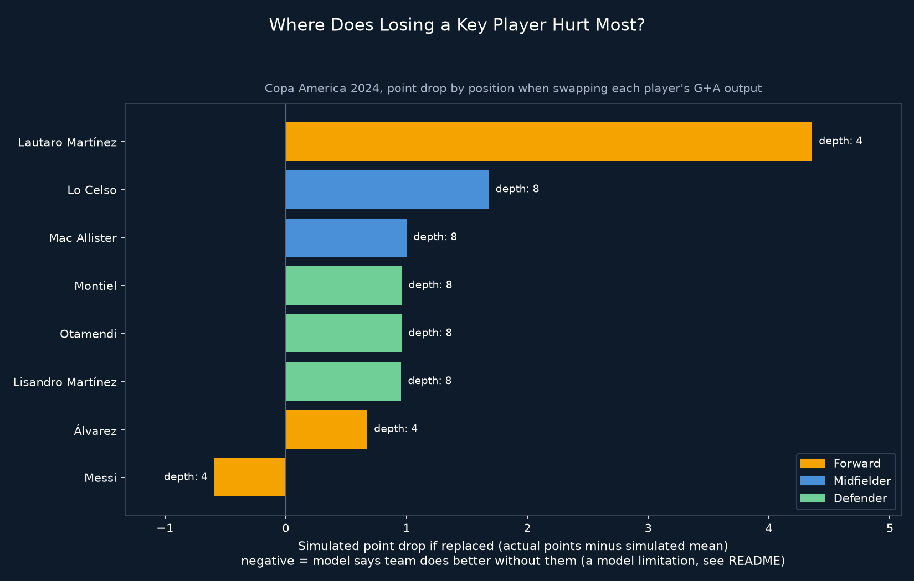

# Position Scarcity Model: Argentina at Copa America 2024

## Why
Day 3 asked what happens if you remove one player's goal and assist output. This project asks the bigger question: across every position, where does losing a key player actually hurt the most? A model is only useful if it works consistently across players, not just the one you expected a dramatic result from.

## What it does
- Reuses Argentina's Copa America 2024 data and the Day 3 Monte Carlo swap method
- Assigns each player a position bucket (Forward, Midfielder, Defender) using their most common position label across the tournament
- Selects the top 8 contributors by total goals and assists
- For each player, builds a replacement pool from teammates in the same position bucket, including matches where those teammates contributed nothing
- Runs 10,000 simulations per player, swapping their actual contribution for a sampled replacement, and measures the resulting point drop

## Key findings
| Player | Position | Replacement depth | Point drop |
|---|---|---|---|
| Lautaro Martínez | Forward | 4 | 4.36 |
| Lo Celso | Midfielder | 8 | 1.68 |
| Mac Allister | Midfielder | 8 | 1.00 |
| Montiel | Defender | 8 | 0.96 |
| Otamendi | Defender | 8 | 0.96 |
| Lisandro Martínez | Defender | 8 | 0.95 |
| Álvarez | Forward | 4 | 0.67 |
| Messi | Forward | 4 | -0.59 |

- Lautaro Martínez shows the highest simulated point drop, driven largely by his 5-goal tournament including a hat-trick, this method is sensitive to volume scoring in a way worth flagging, a single big match can dominate the result
- Messi again shows a negative point drop, repeating the exact same pattern from Day 3: the model estimates the team does slightly better without him. This is not a real finding about his value, it is the same measurement limitation showing up again under a different test

## Limitation
This model only measures goal and assist output. Defenders and defensive midfielders show small, similar point drops not because their actual contribution is small, but because the method cannot see tackles, interceptions, pressing, or buildup play, only direct goal involvement. A player whose value comes primarily from creating space, drawing defenders, or progressing the ball will consistently be undervalued by this approach, as seen twice now with Messi.

## Visual

*Simulated point drop if each player's contribution was replaced, grouped by position. Negative values mean the model estimates the team performs better without that player, a limitation of the method, not a real finding*

## Tools
Python, pandas, numpy, matplotlib, statsbombpy

## Data source
StatsBomb open data (via `statsbombpy`), Copa America 2024, competition_id 223, season_id 282
